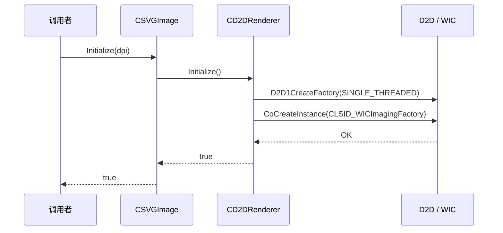
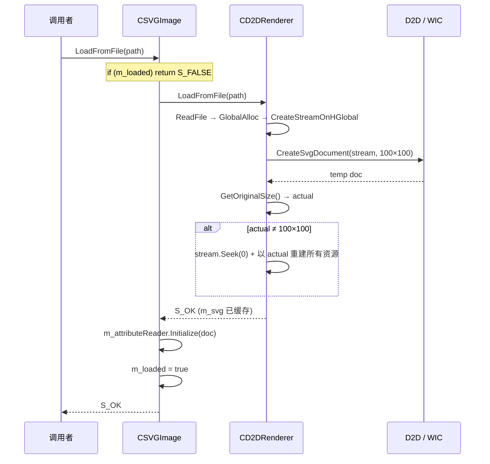
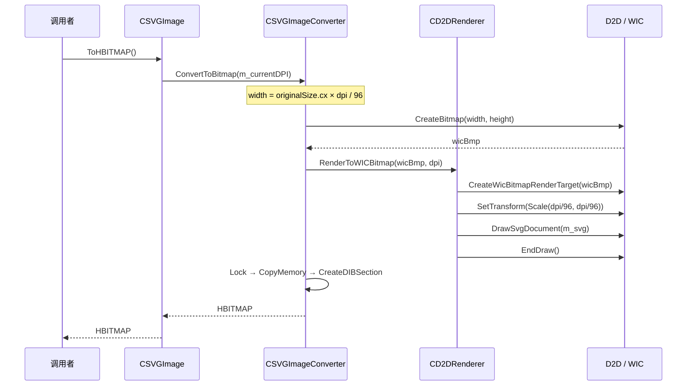
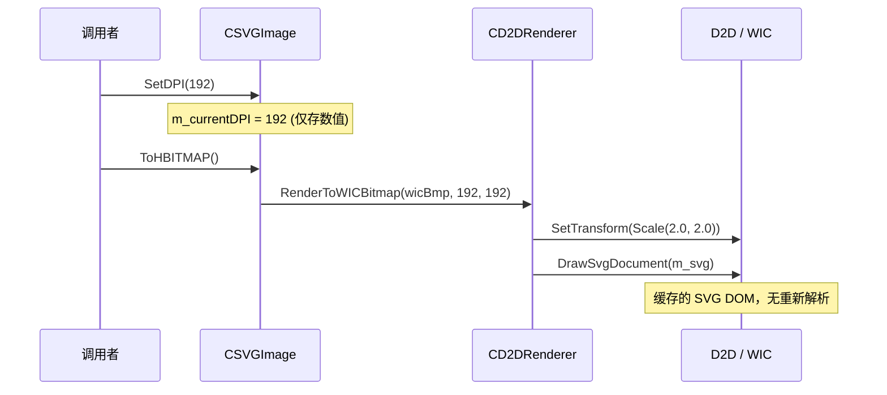

# SvgRender 设计文档

## 1. 概述

SvgRender 是 SvgPreviewTool 的 SVG 渲染引擎。通过 Direct2D SVG API 加载 SVG 文档、读取元数据、渲染到 WIC 位图，并转换为 HBITMAP / GDI+ Bitmap / HICON 三种输出格式。

**核心设计原则**:
- **分层**: API 接口层 → 外观组合层 → 渲染/属性/转换三个独立组件
- **SVG 缓存**: `ID2D1SvgDocument` 是分辨率无关的 DOM 树，Load 一次后可多次渲染到不同 DPI，无需重新解析
- **WIC 中枢**: 所有渲染通过 WIC 位图作为中间像素缓冲区，再逐行复制到目标格式

## 2. 架构

```
                      ISVGImage (API)
                           |
                       CSVGImage (外观)
                      /     |      \
           CD2DRenderer  AttributeReader  CSVGImageConverter
          (渲染+加载)   (读取viewBox等)   (WIC→HBITMAP/GDI+/ICON)
```

| 组件 | 接口 | 职责 |
|------|------|------|
| `CSVGImage` | `ISVGImage` | 组合协调、DPI 状态、幂等加载、生命周期 |
| `CD2DRenderer` | `ISVGRenderer` | D2D/WIC 工厂管理、CreateSvgDocument、RenderToWICBitmap |
| `CD2DAttributeReader` | `ISVGAttributeReader` | 三级回退读取 SVG 原始尺寸 |
| `CSVGImageConverter` | — | WIC 位图 → 目标格式（逐行 CopyMemory） |

**所有权**: `CSVGImage` 以 `unique_ptr` 独占三个子组件。`CSVGImageConverter` 持有指向 Renderer 和 AttributeReader 的裸指针（非拥有）。清理顺序按依赖倒序：converter → attributeReader → renderer（保证 COM 引用计数的析构安全）。

## 3. 数据流与运行流程

### 3.1 初始化



### 3.2 加载流程



### 3.3 转换流程



### 3.4 DPI 变更（不重新 Load）



### 3.5 三级尺寸回退

```
GetOriginalSize():
  1. GetViewBox(&viewBox)     → 有 viewBox 且非零 → 返回 viewBox 尺寸
  2. GetRootSize(&w, &h)      → 有 width/height   → 返回属性尺寸
  3. GetViewportSize()         → 两者皆无           → 返回 CreateSvgDocument 时的 viewport
```

绝大多数图标 SVG 有 viewBox，直接命中优先级 1。

### 3.6 两阶段 Viewport 探测

`CreateSvgDocument` 需要预先提供 viewport 尺寸作为回退坐标空间（优先级 3）。但真实尺寸只有解析后才能获知。方案：先以 100×100 试探解析 → 读取真实尺寸 → 若不同则回绕流以正确尺寸重建。每个 Load 周期最多产生 6-8 个 COM 分配。

### 3.7 DPI 缩放

```
SVG 原始尺寸(cx, cy) × dpi / 96 = 目标位图像素(w, h)
```

DPI 同时在两级生效：位图尺寸缩放 + `SetTransform(Scale(dpi/96, dpi/96))` 坐标变换。DPI 变更无需重新 Load——缓存的 `ID2D1SvgDocument` 是矢量树，直接重新渲染即可。

## 4. 关键设计决策

### 4.1 幂等加载与 DPI 缓存

`LoadInternal` 成功后将 `m_loaded` 置为 `true`。后续 `Load*` 调用直接返回 `S_FALSE`，跳过磁盘 I/O 和 XML 解析。加载不同 SVG 前需显式调用 `Reset()` 清除缓存。

`SetScale()`（DPI 变更）只做 `SetDPI + ToHBITMAP`，不再调用 `LoadSvgFile()`。

### 4.2 WIC 渲染目标每次重建

`CreateWicBitmapRenderTarget` 创建时永久绑定到传入的 `IWICBitmap`——无法 rebind。由于每次转换的目标位图尺寸可能不同（DPI 变化），`RenderToWICBitmap()` 每次都重建 render target 和 device context。WIC RT 是纯软件实现，`EndDraw()` 同步提交，无需 GPU flush。

### 4.3 清理顺序约束

```
m_converter.reset()       → 释放裸指针
m_attributeReader.reset() → 释放 ComPtr<ID2D1SvgDocument> (需在 context 释放前)
m_renderer->Cleanup()     → 释放 m_context / m_svg / m_wicBitmap
m_loaded = false
```

attributeReader 持有对 SVG 文档的 COM 引用，SVG 文档内部可能引用 D2D 上下文。必须先释放 attributeReader，再释放 renderer。

### 4.4 强异常安全保证

`LoadFromStreamInternal` 在局部 `ComPtr` 中构建所有新状态，仅在全部成功时提交到成员——失败时成员不变。`LoadInternal` 采用 save/restore 模式：旧 reader 和 converter 被移出，失败时移回。`To*` 系列为基本保证。

### 4.5 像素格式：预乘 BGRA

全链路使用 `GUID_WICPixelFormat32bppPBGRA`（预乘 BGRA）。GDI+ 输出为 `PixelFormat32bppPARGB`（预乘 ARGB）。两者在 little-endian 下内存布局一致（B, G, R, A），逐行 `CopyMemory` 无需转换。HBITMAP 通过 `AlphaBlend + AC_SRC_ALPHA` 正确处理预乘源。

### 4.6 线程安全

```
CSVGImage::m_mutex (外层) → CD2DRenderer::m_mutex (内层)
```

固定调用链先外层后内层，消除死锁风险。`CSVGImageConverter` 无自有锁，依赖外层保护。D2D 工厂类型为 `SINGLE_THREADED`，所有 D2D 调用必须串行化——MFC 主 UI 线程满足此约束。

### 4.7 单线程 D2D 工厂

使用 `D2D1_FACTORY_TYPE_SINGLE_THREADED`。MFC 应用通过主 UI 线程驱动所有渲染操作，自然满足串行化。若引入后台线程渲染，需改为 `MULTI_THREADED` 并重新评估锁策略。

## 5. 错误处理

| 返回值 | 含义 |
|--------|------|
| `S_OK` | 成功 |
| `S_FALSE` | 幂等——已加载，无需操作 |
| `E_POINTER` | 输入参数为 null |
| `E_FAIL` | 通用失败（文件不存在、解析失败等） |
| `E_INVALIDARG` | 文件超过 4 GB 限制 |
| `E_OUTOFMEMORY` | GlobalAlloc 失败 |
| `E_UNEXPECTED` | 渲染器未初始化 |

**已知边界**:
- 非 Seekable IStream + 尺寸不匹配 → Load 返回 `E_FAIL`。`LoadFromFile`/`LoadFromResource` 创建的 HGLOBAL 流均支持 Seek，此边界仅在外部直接调用 `LoadFromStream` 时触发
- 无 viewBox / width / height 的 SVG → 坐标空间退回到试探 viewport（100×100），符合 SVG 规范回退
- 调用方必须事先调用 `CoInitializeEx` 和 `GdiplusStartup`

## 6. 测试策略

测试项目 `SvgRenderTest/main.cpp` 为无 UI 控制台程序，直接链接 `SvgRender.lib`。

**覆盖矩阵**（16 个测试）:

| 类别 | 测试 | 验证点 |
|------|------|--------|
| 生命周期 | BasicLifecycle | Init / Cleanup 空循环 |
| 加载 | LoadFromFile, InvalidFile, NoInitLoad | 正常/缺失/未初始化路径 |
| 输出 | ToHBITMAP, ToGdiPlusBitmap, ToHICON | 三种格式转换 |
| 状态 | DPIScale, DPIReRender, LoadIdempotent, ResetAndReload | DPI 缩放、幂等加载、Reset |
| 资源 | RepeatedLoad (×10), StressTest (×100), HeapSnapshot | 内存泄漏检测 |
| 语义 | MoveSemantics | 移动构造/赋值 |

**内存测试方法**: StressTest 采用 "Load 一次 → 100 次 Render（循环变换 DPI）" 模式，隔离渲染路径。内存曲线完全平坦证明渲染路径无泄漏。HeapSnapshot 使用 `_CrtMemDifference` 在操作前后进行堆快照对比。

**运行方式**: 测试必须从 `$(OutDir)` 目录运行（测试 SVG 使用相对路径 `../svg/closedefault_SVG.svg`）。

## 附录 A: 技术参考

### A.1 COM / WIC / D2D 基础

| 概念 | 说明 | 本模块中的角色 |
|------|------|--------------|
| `ComPtr<T>` | COM 接口的 RAII 智能指针，析构自动 `Release()` | 所有 D2D/WIC 对象管理 |
| `IWICImagingFactory` | WIC 位图工厂 (`CoCreateInstance`) | 创建 `IWICBitmap` |
| `IWICBitmap` | CPU 可访问的像素缓冲区 | D2D 渲染目标 + 转换数据源 |
| `ID2D1Factory1` | D2D 入口工厂 (`D2D1CreateFactory`) | 创建渲染目标 |
| `ID2D1RenderTarget` | 渲染目标——"画在哪里" | `CreateWicBitmapRenderTarget` |
| `ID2D1DeviceContext5` | 设备上下文——"怎么画"，支持 SVG | QI from RenderTarget |
| `ID2D1SvgDocument` | 解析后的 SVG DOM 树，分辨率无关 | 加载缓存 + 渲染输入 |
| `IStream` | COM 顺序数据流 | `CreateStreamOnHGlobal` 封装 HGLOBAL |

**COM 规则**: `AddRef()`/+1, `Release()`/-1 归零自毁。`QI` (QueryInterface) 获取其他接口指针时自动 AddRef。ComPtr 赋值 `m_a = b` 等价于 `m_a.Reset(); b->AddRef(); m_a = b`。

**WIC 位图格式**:

| 属性 | 值 |
|------|-----|
| 像素格式 | `GUID_WICPixelFormat32bppPBGRA` |
| 每像素 | 4 字节，通道顺序 B-G-R-A (little-endian) |
| Alpha | 预乘 (Premultiplied): `R' = R × A/255` |
| 缓存模式 | `WICBitmapCacheOnLoad` |
| 步幅 | WIC: `width × 4`; DIB: `(width × 4 + 3) & ~3` (4 字节对齐) |

**预乘 Alpha**: 存储的 R/G/B 已乘以 A 分量，合成时省去一次乘法。公式: `result = src.RGB + dst.RGB × (1 - src.A/255)`。

### A.2 SVG 坐标优先级

```
viewBox (优先级 1) → width/height 属性 (优先级 2) → viewport 参数 (优先级 3)
```

- `viewBox="minX minY width height"`: 定义用户坐标空间，覆盖一切
- `width`/`height`: 输出尺寸（CSS 单位）
- 两者皆无: 退回到 `CreateSvgDocument` 的 viewport 参数

### A.3 三种 D2D RenderTarget

| 方法 | 底层 | 开销 | 本模块使用? |
|------|------|------|-------------|
| `CreateWicBitmapRenderTarget` | 纯 CPU 软件 | 最轻 | **是** |
| `CreateHwndRenderTarget` | 绑定 HWND | 需要窗口 | 否 |
| `CreateDxgiSurfaceRenderTarget` | GPU (D3D) | 需要 D3D Device | 否 |

选择 WIC RT 的原因：离屏渲染无需窗口，避免 GPU 依赖，SVG 图标分辨率低（<1024×1024）软件光栅化性能足够。

### A.4 资源生命周期

| 路径 | COM 分配 | XML 解析 | 典型场景 |
|------|---------|----------|---------|
| Load (最坏) | 6-8 次 | 2 次 | 首次打开不同尺寸的 SVG |
| Load (尺寸恰好 100×100) | 4 次 | 1 次 | 罕见巧合 |
| Render (每次) | 3 次 (WIC bitmap + RT + Context) | 0 | 每次 ToHBITMAP/ToGDI+/ToICON |
| DPI 变更渲染 | 3 次 (仅渲染) | 0 | SetScale → ToHBITMAP |

## 附录 B: 文件索引

| 文件 | 用途 |
|------|------|
| `SvgAPI/ISVGImage.h` | 面向用户的主接口（Load / To* / SetDPI / Reset / Cleanup） |
| `SvgAPI/ISVGRenderer.h` | 渲染器接口 |
| `SvgAPI/ISVGAttributeReader.h` | 属性读取器接口 + SVG 属性名宏 |
| `SvgRender/Image/CSVGImage.h` | 外观类头文件 |
| `SvgRender/Image/CSVGImage.cpp` | LoadInternal、SetDPI、Cleanup 实现 |
| `SvgRender/Renderer/D2DRenderer.h` | D2D 渲染器头文件 |
| `SvgRender/Renderer/D2DRenderer.cpp` | LoadFromStreamInternal、RenderToWICBitmap 实现 |
| `SvgRender/Attribute/D2DAttributeReader.h` | 属性读取器头文件 |
| `SvgRender/Attribute/D2DAttributeReader.cpp` | GetViewBox、GetRootSize、GetOriginalSize 实现 |
| `SvgRender/Converter/SVGImageConverter.h` | 转换器头文件 |
| `SvgRender/Converter/SVGImageConverter.cpp` | RenderToWICBitmap、CopyWICToHBITMAP 等实现 |
| `SvgRenderTest/main.cpp` | 16 项内存泄漏与功能测试 |
| `ImagePreview/SvgChildFrm.cpp` | MFC UI 集成（SetScale、LoadSvgFile） |
